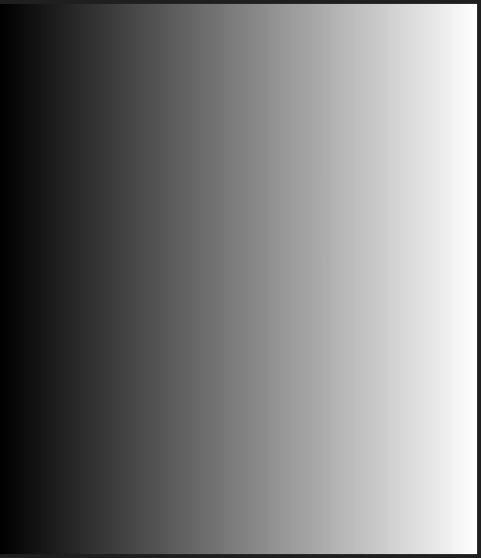
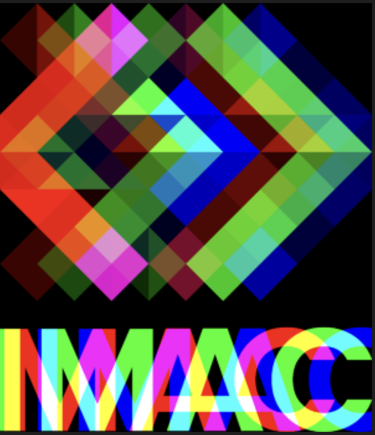
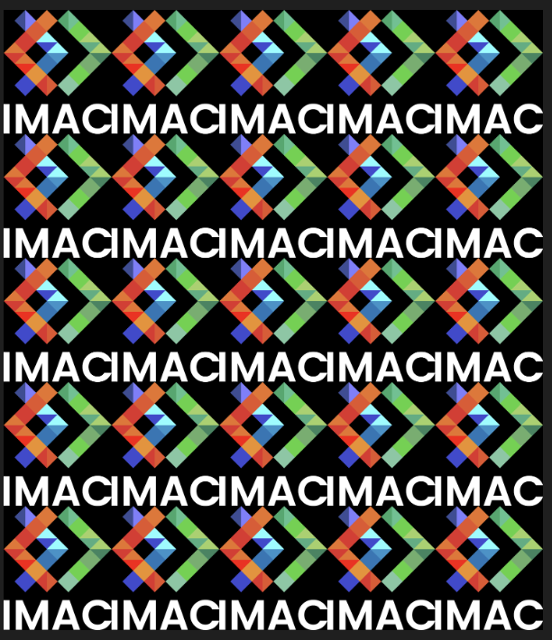
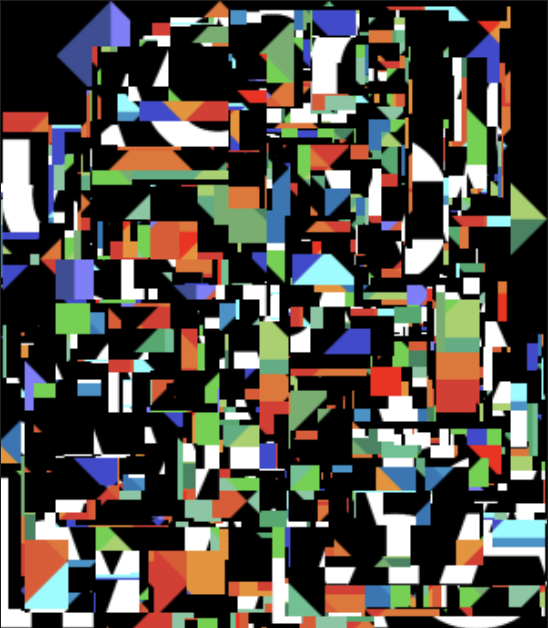
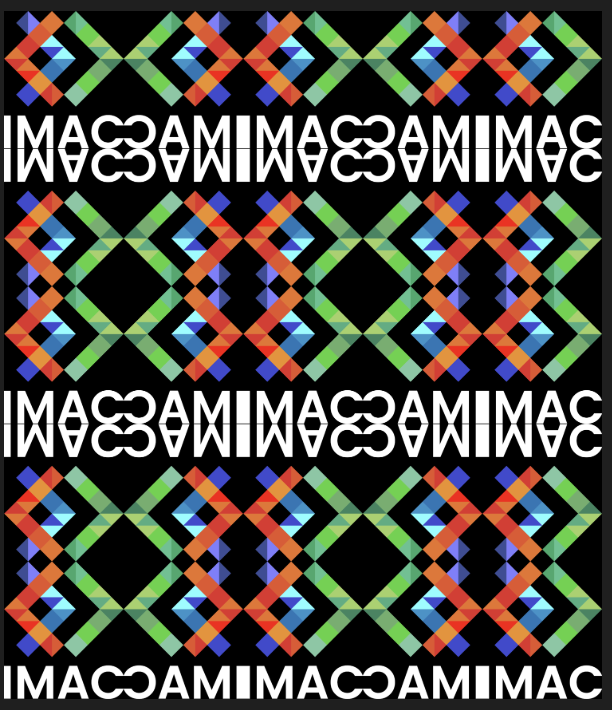
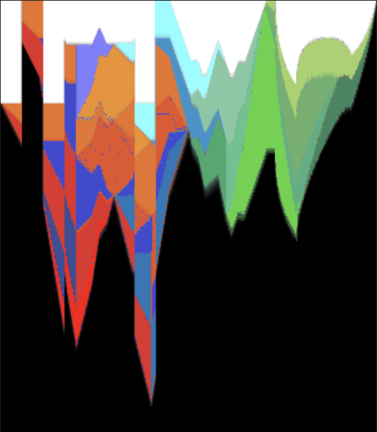
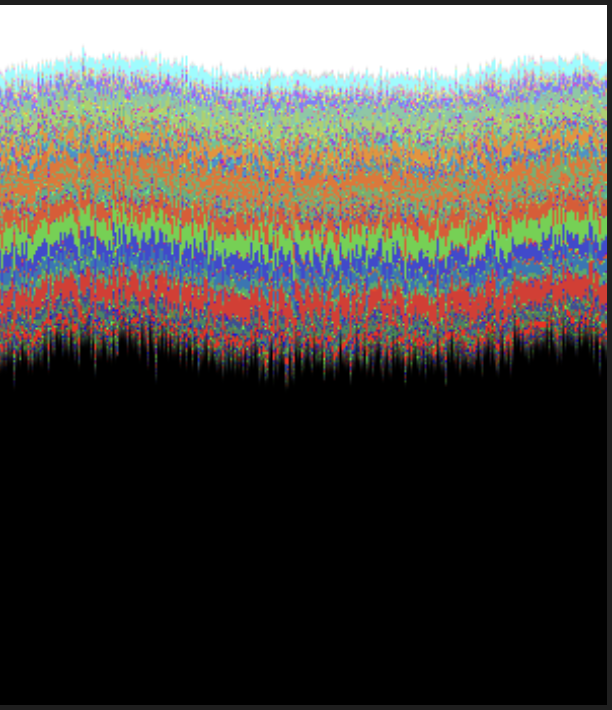
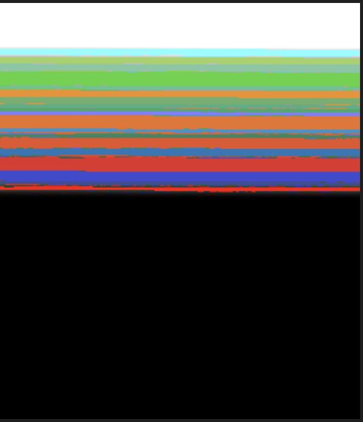

# 🐣 S1 | Prog: Workshop Laïn 

# Compte rendu de mon expérience :

## Exercices complétés :

**Ne garder que le vert** ⭐️

**Echanger les canaux** ⭐️

**Noir & Blanc** ⭐️

**Négatif** ⭐️

**Dégradé** ⭐️

**Miroir** ⭐️⭐️

**Image Bruitée** ⭐️⭐️

**Rotation 90°** ⭐️⭐️

**RGB Split** ⭐️⭐️

**Luminosité** ⭐️⭐️

**Mosaïque** ⭐️⭐️

**Glitch** ⭐️⭐️⭐️

**Pixel Sorting (plus ou moins)** ⭐️⭐️⭐️

*voir ci-dessous dans les bonus !*

**Mosaïque Miroir** ⭐️⭐️⭐️⭐️

## Fonctions Bonus !

**Pixel Melting** 🫠

**Pixel Melting (Sinus)** 🫠

**Pixel Sorting (Couché de soleil)** 🌅

